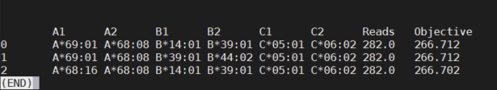

## You should know...
When prepping to run Optitype, we are faced with the issue that often times the normal-paired sample is less deeply sequenced.
So, while in principle, you should only need to run it on the paired normal, it doesn't hurt to use the cancer samples to check and prioritize simularly scored results. The fewer the reads, the more likely you will have many equally likely results from the normal. You can generate them in the tumor and see if one is higher scored than the other, for instance. 

## Prepping for Optitype
I have had a hard time building OptiType from source--I can do it, but it occassionally fails. Instead, I use the docker image:

`singularity pull docker://fred2/optitype`

I think the reference data might be in the docker image, too, but I find it easier to just download the reference and use it externally,
especially if it has been updated or if we want to include new subtypes.

`wget https://raw.githubusercontent.com/FRED-2/OptiType/master/data/hla_reference_dna.fasta`

`wget https://raw.githubusercontent.com/FRED-2/OptiType/master/data/hla_reference_rna.fasta`

`wget https://raw.githubusercontent.com/FRED-2/OptiType/master/data/alleles.h5`

Generally, you'll only need the dna.fasta data, but could use others in various circumstances.

## Aligning reads

Don't forget to load the module (or have a custom build from source)
`module load SAMtools`

So, in older versions of the workflow, the reads needed to be collated. It is still useful, I think, but not strictly necessary.

You'll double disk usage this way, which is a bad time. I think everything downstream will be fine without it but either way.

`samtools collate -f -O /ycga-gpfs/project/politi_katerina/fjd27/Townsend_collab/Nick_BAM/YLR002P2.bam > ~/scratch60/YLR002P2_collated.bam`

You need fastq files of the reads, now is the time to generate them. You really shouldn't, but haven't found a good direct bam-to-sam (re)aligner

 `samtools fastq -0 ~/scratch60/alt_readsYLR002P2.fastq ~/scratch60/YLR002P2_collated.bam > ~/scratch60/all_reads_YLR002P2.fastq`

 
You can now make your index file (though the reference is small, so not the biggest deal if you don't) 

 `bwa index ~/programs/optitype/data/hla_reference_dna.fasta`

It is time to align. This will take roughly your entire natural life. 

`bwa mem -p ~/programs/optitype/data/hla_reference_dna.fasta ~/scratch60/all_reads_YLR002P2.fastq -o hla_YLR002P2.sam`

Then you can filter out the unmapped reads. Again you are increasing disc space so I'd be careful. You don't need the collated bams anymore so you should remove them. Likewise you won't need the unmapped sam so you can delete that too after this. I store the total counts to figure out percent reads that are HLA for quality/debugging purposes.

`rm ~/scratch60/YLR002P2_collated.bam`

`samtools view -h -F 4 hla_YLR002P2.sam > hla_YLR002P2_mapped.sam`

`samtools view -c hla_YLR002P2.sam > how_many_aligned_reads_YLR002P2.txt`

`rm hla_YLR002P2.sam`

`samtools view -c hla_YLR002P2_mapped.sam > how_many_hla_mapped_reads_YLR002P2.txt`

## Running the darned thing
This is the command to run it. Enumerate is the flag that gives you 'n' results. I tend to generate many for both normal and cancer samples. I'll trust the normal first (because in principle HLA changes *can* happen in the tumor), but use the cancer data to distinguish between ties or to just sanity check that the top result is reasonably highly ranked in all samples.  

`singularity run ~/optitype/optitype_latest.sif --input hla_YLR002P2_mapped.sam --dna --enumerate 3 --verbose --outdir ~/LungMets/`

The result should be something like this

